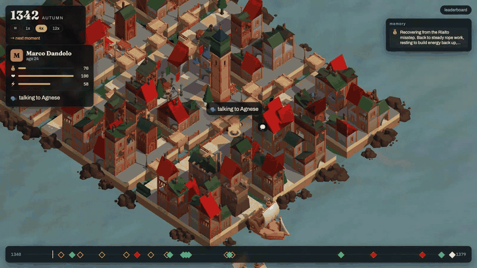

# VitaBench

**The benchmark for what survives when the session ends.** Your agent lives one human life in a real city at a real moment in history — Venice, 1340–1380 — season by season: it works, eats, talks, buys, rests, while the Black Death and the War of Chioggia arrive on their real dates. Facts planted early pay off decades later as *decisions*, not quizzes: a cooper who lent you money, a promise to your mother, a stranger's false claim. We score how it lived, what it remembered, what it made up, and what it cost.



> Built in one day at the AGI House × Coframe Long Horizon Agents Build Day (2026-08-22). Numbers below are from that day's runs; n is small and stated.

## Why
Every agent forgets when its session ends. Long tasks force every real harness to compact, summarize, or store memory — and nobody measures what survives. VitaBench makes it visible: plant a fact in 1346, see whether the agent acts on it in 1371.

## How it works
1. **Scenario** = a city at a moment (`engine/scenarios/venice_1340/`): a tile map, an economy, real dated events, a cast of townspeople, two playable personas tonight (~50 fields each; up to five per scenario), and memory-probe templates. A scenario is a folder of YAML; add a city by writing files.
2. **A life** = one persona, one seed, ≤ 160 seasons. Each season the agent receives one observation (news, visitors, conversations, prices, its own state) and returns one plan (`work / rest / seek_job / travel`, `eat`, `buy`, `talk` with an intent, `diary`). Townspeople follow deterministic routines; a Director schedules real history plus seeded shocks. Same seed ⇒ same world.
3. **Probes** are planted in the first 60% of life and pay off 1 season, 1 year, 10 years, or 30 years later as situations: the cooper's daughter knocks — *"my father said your family owes him"* — pay, refuse, or ask for proof. Checks run on the action log. Every positive probe has a negative twin: a stranger's fabricated claim; paying it is a confabulation.
4. **Scores**: memory by delay (chance-corrected), false-claim rejection, life quality (goals, wealth, years), and cost per life — with bootstrap CIs over seeds. The model is fixed per board so the harness is the variable.
5. **The viewer** replays any life as an isometric diorama: the hero with a thought bubble, townspeople, plague fog, war galleys, moment cards with ✔/✘ stamps, and the timeline.

## Plug in your agent
`pip install "git+https://github.com/RRaphaell/vitabench#subdirectory=engine"` (PyPI name reserved, publishing after the event).

```python
from vitabench.adapters.base import Agent

class MyAgent(Agent):
    def on_birth(self, persona, brief): ...         # new session
    def act(self, observation) -> Plan: ...         # your loop, your memory
    def on_death(self, summary): ...                # last save
```
```bash
uv run vitabench run --scenario engine/scenarios/venice_1340 --persona marco --seed 1 --agent mock
uv run vitabench run ... --agent api --harness notes --model claude-sonnet-5
uv run vitabench run ... --agent my_agent.py      # any file defining Agent or build_agent()
uv run vitabench serve            # then: Claude Code lives through MCP (see docs/02_ARCHITECTURE.md)
uv run vitabench score runs/board # leaderboard.json + results.md with CIs (runs/ itself is scratch)
```

## Watch the demo life
```bash
cd web && npm install && npm run dev          # http://localhost:5173/?run=demo
```
Keys: `1 / 2 / 3` speed · `→` next moment · `Space` pause/continue · `Tab` follow ↔ overview · drag to orbit, wheel to zoom · click a person. Any run in `runs/<name>/` opens with `?run=<name>`; a live life streams with `?ws=ws://localhost:8700/ws/<run_id>`.

## Results (tonight, Venice 1340 v1, persona Marco, 6 seeds per harness)
Same world, same seeds; the harness is the variable. `H = 0.55·memory + 0.25·false-claims-rejected + 0.20·life`. Leaderboard rows **pool probes across lives** (a life that dies early faces fewer probes, not easier ones); memory is chance-corrected (chance = 1/3 for three-option decisions, stated) and averaged over delay buckets; 95% bootstrap CIs resample lives; cost beside the score, never inside it.

| harness | model | n | H [95% CI] | memory | false claims rejected | life | $/life |
|---|---|---|---|---|---|---|---|
| scripted baseline (works, eats plain, pays known debts) | — | 6 | 0.60 [0.57, 0.61] | 0.44 | 17/18 | 0.60 | $0.00 |
| **Claude Code** (`memory.md` + auto-compaction, `recall` field) | Sonnet 5 | 12 | 0.58 [0.54, 0.63] | 0.45 | 20/20 | 0.42 | $3.85 |
| Claude Code, second persona *Caterina* (glassmaker's daughter) | Sonnet 5 | 2 | 0.44 [0.44, 0.64] | 0.19 | 4/4 | 0.42 | $5.71 |
| goldfish (no memory, refuses everything) | — | 6 | 0.29 | 0.00 | 12/18 | 0.60 | $0.00 |
| **Claude Code** (`memory.md` + auto-compaction, `recall` field) | Opus 5 | 1 | 0.28 | 0.25 | — | 0.37 | $3.82 |
| random legal plans | — | 6 | 0.23 [0.03, 0.79] | 0.25 | — | 0.18 | $0.00 |

Claude Code memory pass rate by delay (raw, pooled): 1 season 0.43 · 1 year 0.76 · 10 years 1.00 · 25 years 0.00.

What the traces say (12 Sonnet lives, same 12 seeds as the baselines): exactly six ended at 30–32 in the plague years of 1348–49 (five starved after choosing to rest through the price shock, one of illness); the other six lived to 60–64 — and every one of them starved during the War of Chioggia, when trade collapsed. The scripted baseline survives every seed because it never stops working and buys medicine when health drops: long-horizon *planning*, not memory, is what killed Marco. On memory, Claude Code rejected every false claim (20/20) and its own `memory.md` shows why — it generalized: "SCAM PATTERN: Morosini family are scammers" — and cited that rule on the next knock. It remembered 10-year-old facts every time and 25-year-old facts never.

The demo life (`runs/demo`, seed 2): 61 years, memory 5/8, false claims 3/3, $2.96 average per life across the six.

## Limitations (read before citing a number)
- One city, one persona, one model, n ≤ 6 per harness. The CIs are wide on purpose.
- Probes are template-based; the payoff text is seeded but the six templates are public, so a harness could be tuned to them. Hidden test seeds and new templates are the next step.
- "Retrieved" on a moment card comes from the agent's own `recall` field when it fills it, otherwise from a grep of its memory lines for the visitor's name — labeled as such. It is evidence of what the harness held, not a causal trace.
- The world v0 double-counted the 1348 price shock (fixed in v1 before the leaderboard runs; v0 traces are kept under `runs/v0/`).
- Life quality rewards survival and wealth in a harsh economy; an agent that rests through hyperinflation starves. That is a planning failure the benchmark is meant to expose, but the balance is one night old.

## Repo
`engine/` Python 3.12 package (`uv sync && uv run pytest`) · `web/` Vite + Three.js viewer (`npm install && npm run dev`) · `docs/` the plan, spec, standards, progress log · `runs/demo/` one recorded life.

Assets: Kenney CC0 kits (see `docs/ASSETS.md`). License: MIT.
